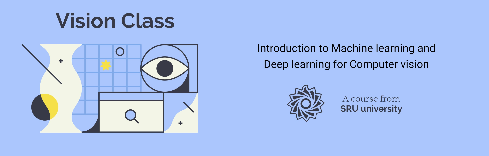

# Vision Class

Introduction to Machine learning and Deep learning for Computer vision, A course from SRU university of Tehran.

## Sessions

### Computer Vision

S1 - <i>Course Introduction</i>

#### Topics
`Computer vision overview`
`Course logistics`

#### NoteBooks

#### Slides
[PDF](http://class.vision/96-97/01_intro.pdf)

#### Student notes

#### Videos

#### Practices

S2 -  <i>Opencv basics in python</i>

#### 🎯 Topics
- Reading Images
- Color Spaces
- Displaying Images
- Saving Images

#### 📒 NoteBooks
1. Reading, writing and displaying images
2. Grayscaling
3. Color Spaces

#### 📝 Student notes

#### 🎞 Videos

#### 🛠 Practices

S3 - <i>Image manipulation (part 1)</i>

#### Topics
`Linear aljebra`
`Transform matrixes`
`Interpolation Methods`

#### Slides
Image manipulations(1) [ [PDF]([http://class.vision/96-97/01_intro.pdf](http://class.vision/96-97/02_Image%20manipulations(1).pdf)),
[PPT]([http://class.vision/96-97/01_intro.pdf](http://class.vision/96-97/02_Image%20manipulations(1).pptx)) ]

#### 📒 NoteBooks

#### 📝 Student notes

#### 🎞 Videos

#### 🛠 Practices

S4 - <i>Image manipulation functions in OpenCV</i>

#### Topics
`Draw geometric shapes`
`Transform matrixes`
`Translations`
`Rotation`
`Resizing`
`Image pyramid!`
`Cropping`

#### Slides
Image manipulations(1) [ [PDF]([http://class.vision/96-97/01_intro.pdf](http://class.vision/96-97/02_Image%20manipulations(1).pdf)),
[PPT]([http://class.vision/96-97/01_intro.pdf](http://class.vision/96-97/02_Image%20manipulations(1).pptx)) ]

#### 📒 NoteBooks
04-Drawing Images.ipynb
05-Translations.ipynb
06-Rotations.ipynb
07-Scaling, re-sizing and interpolations.ipynb
08-Image Pyramids.ipynb
09-Cropping.ipynb

#### 📝 Student notes

#### 🎞 Videos
[aparat](https://www.aparat.com/v/vaYxt)

P1 - <i>🛠 Intros</i>

S5 - <i>Image manipulation (part 2)</i>

#### Topics
`Logical and Mathematical Operations in OpenCV`
`Image masking in OpenCV`
`Convolution and Correlation filters`
`Moving average`
`Sharpening`
`Filters in OpenCV`

#### Slides
Image manipulations(2) [ [PDF](http://class.vision/96-97/03_Image%20manipulations(2).pdf),
[PPT](http://class.vision/96-97/03_Image%20manipulations(2).pptx) ]

#### 📒 NoteBooks
10-Arithmetic Operations.ipynb
11-Bitwise Operations and Masking.ipynb
12-Convolutions and Blurring.ipynb
13-Sharpening.ipynb

#### 📝 Student notes

#### 🎞 Videos
[aparat]([https://www.aparat.com/v/vaYxt](https://www.aparat.com/v/W8deM))

S6 - <i>Binary Images, Threshold, and Morphology Operation</i>

#### Topics
`Images kinds!`
`Binary images`
`Threshold`
`Thresholding in OpenCV`
`Morphology (Dilation, Opening, Closing)`
`Morphology in OpenCV`

#### Slides
Binary Images and Morphology `[PDF](http://class.vision/96-97/04_Morphology.pdf)`
`[PPT](http://class.vision/96-97/04_Morphology.pptx)`

#### 📒 NoteBooks
14-Thresholding, Binarization & Adaptive Thresholding.ipynb
15-Dilation, Erosion, Opening and Closing.ipynb

#### 📝 Student notes

#### 🎞 Videos
[aparat](https://www.aparat.com/v/tMB7C)

