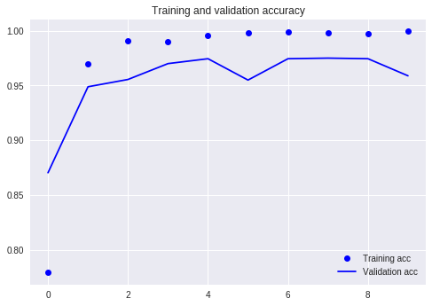
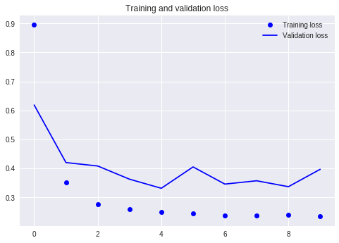

##  Computer Vision

# Places Recognizer Project

Mahya Mahdian - 94471039 

Mohammad Hassan Sattarian - 94471035

---

## Initializing Colab Environment

Unfortunately files are not kept in colabs environment more than 12 hours and this steps are neccesary each time.

##### Importing and using required authentication functions for Transfering data from **Drive** to **Colab**:

```python
!pip install -U -q PyDrive # PyDrive is an easy-to-use wrapper for googleOAuth
import os
from pydrive.auth import GoogleAuth
from pydrive.drive import GoogleDrive
from google.colab import auth
from oauth2client.client import GoogleCredentials

# Authenticate and create the PyDrive client. remmmber that 
auth.authenticate_user()
gauth = GoogleAuth()
gauth.credentials = GoogleCredentials.get_application_default()
drive = GoogleDrive(gauth)
```

##### Listing files available in Drive directory ***[CV project](https://drive.google.com/drive/folders/1UO9LYakqN6GEvXGRZYNkwPQMAqMARw55?usp=sharing)***

if mentioned directory is not available replace folder-id in following cell with a valid folder-id containing required files (Base model, Weights, Train Script, ...).

```python
file_list = drive.ListFile( # list files in a drive folder given it's Id
    {'q': "'1GBXbaaNCrTctlo9YU8ODfmyHCgB-mQXa' in parents"}).GetList()

for f in file_list:
  # Create & download by id.
  print('title: %s, id: %s' % (f['title'], f['id']))
  
```

##### Yet our colab environment is empty!

looking for a proof? :

```python
!ls # terminal commands are accessible using ! operator!
```

##### *Transferring* files from Drive to Colab:

```python
for f in file_list:
  fname = f['title']
  f_ = drive.CreateFile({'id': f['id']})
  f_.GetContentFile(fname)
```

##### now files are in colab environment:

```python
!ls
```

##### Unzip images file:

```python
!unzip -aq dataset.zip
```

## training

##### Base Model used in this Fine tuning Network is a [VGG16 network pretrained Places365-Standard](https://github.com/GKalliatakis/Keras-VGG16-places365).
this network is implemented in **vgg16_places_365** file and imported in the code.

##### Required libraries and base model (vgg16-places) without fully-connected layers imported. 5 last layers of base model would be *unfrozen*.

##### Then own model based on VGG616:Places365 model with additional fully-connected layers containing 256 and 6 nodes, with, respectively Relu and Softmax as activation functions for detecting nonlinearities and coding result in 6 classes is defined:

```python
from vgg16_places_365 import VGG16_Places365
from keras import layers, models, optimizers

base_model = VGG16_Places365(include_top=False, weights='places', input_shape=(108, 192, 3))

# making 5 last layers *Unfreez*
for layer in base_model.layers[:12]:
  layer.trainable = True

for layer in base_model.layers[12:]:
  layer.trainable = False

model = models.Sequential()
model.add(base_model)
model.add(layers.Flatten())
model.add(layers.Dense(256, activation='relu'))
model.add(layers.Dense(6, activation='softmax'))
```

##### base model and model summeries are printed. mainly to check trainable data numbers:

```python
base_model.summary()
model.summary()
```

##### data agumentation methods are used to achive better result; methods to augument images selected according to real-life situations to simulate real cases.

```python
from keras.preprocessing.image import ImageDataGenerator

train_datagen = ImageDataGenerator(
    rescale=1./255,
    rotation_range=40,
    shear_range=0.2,
    zoom_range=0.2,
    fill_mode='nearest'
)

# Note that the validation data should not be augmented!
test_datagen = ImageDataGenerator(rescale=1./255)

# data generators are used to feed the network from **Train** and **Test** directories.
train_dir = 'Train'
validation_dir = 'Test'

train_generator = train_datagen.flow_from_directory(
        # This is the target directory
        train_dir,
        # All images will be resized to 150x150
        target_size=(108, 192),
        batch_size=20,
        # Since we use binary_crossentropy loss, we need binary labels
        class_mode='categorical')

validation_generator = test_datagen.flow_from_directory(
        validation_dir,
        target_size=(108, 192),
        batch_size=20,
        class_mode='categorical')


```

##### Compiling the model with *categorical_crossentropy* loss 'cause our problem is categorical using RMSProp optimizer and *accuracy* metrics; then fitting it with created generators within 30 epochs.
(this step would take some time!)

```python
model.compile(loss='categorical_crossentropy',
            optimizer=optimizers.RMSprop(lr=2e-5),
            metrics=['acc'])

history = model.fit_generator(
    train_generator,
    steps_per_epoch=149,
    epochs=10,
    validation_data=validation_generator,
    validation_steps=90)
```

##### showing visualizations of model
  *Training and validation accuracy*
                   and
    *Training and validation loss*
                  plots

```python
import matplotlib.pyplot as plt

acc = history.history['acc']
val_acc = history.history['val_acc']
loss = history.history['loss']
val_loss = history.history['val_loss']

epochs = range(len(acc))

plt.plot(epochs, acc, 'bo', label='Training acc')
plt.plot(epochs, val_acc, 'b', label='Validation acc')
plt.title('Training and validation accuracy')
plt.legend()

plt.figure()

plt.plot(epochs, loss, 'bo', label='Training loss')
plt.plot(epochs, val_loss, 'b', label='Validation loss')
plt.title('Training and validation loss')
plt.legend()

plt.show()
```





##### finally for testing, an unseen image is down/loaded and used for prediction:

```python
from keras.preprocessing import image
import numpy as np
from keras.applications.imagenet_utils import _obtain_input_shape
from places_utils import preprocess_input # places_utiles file is provided by VGG16:places contributors.

# labels ordered corresponding to recognized classes by model.
# extracted from --> label_map = (train_generator.class_indices)
labels = ['Architect Campus', 'Buffet', 'Computer Campus', 'Culture house', 'Field', 'Self']

# downloafing unseen image
!wget https://image.ibb.co/e0iWXy/CC_807.jpg # image in 'Computer Campus' category

# predicting
img_path = 'CC_807.jpg'
img = image.load_img(img_path, target_size=(108, 192))
plt.imshow(img) # showing image in cell's output (if not showing add '%matplotlib inline')
x = image.img_to_array(img)
x = np.expand_dims(x, axis=0)
x = preprocess_input(x)

# printing prediction 
prediction = model.predict(x)
# y_classes = y_prob.argmax()     # -->  uncomment for printing it's most probable Class Number
# y_true_labels = train_generator.classes    # --> uncomment for printing each train image Class Number
print (prediction)

# Printing each class probability
for i, p in enumerate(prediction[0]):
  print('%s Probability: \t %f' % (labels[i], p))
```

## Save and Backup

##### Saving model for further use:

```python
model.save('model.h5')
```

##### transferring saved model to google drive:

```python
from googleapiclient.http import MediaFileUpload
from googleapiclient.discovery import build
drive_service = build('drive', 'v3')

file_metadata = {
  'name': 'SRU_Places_6.h5', # name of the saved file
  'mimeType': 'text/plain'   # type of the saved file
}
media = MediaFileUpload('model.h5', # name of existing file
                        mimetype='text/plain',
                        resumable=True)
created = drive_service.files().create(body=file_metadata,
                                       media_body=media,
                                       fields='id').execute()
print('File ID: {}'.format(created.get('id'))) # after successful transfer FileId would be printed
```
